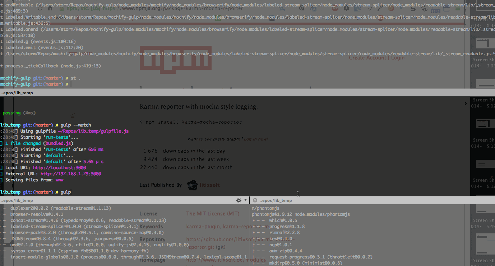

##Install
`npm install`

##Usage

`gulp`      - normal run
`gulp test` - normal run

`gulp --watch` - opens Browser

`--tunnel` - option to make external Public URL for debugging

'./dist' - folder which contains only bundled source code

'./debug' - folder contains bundled unit tests + source code for debugging
